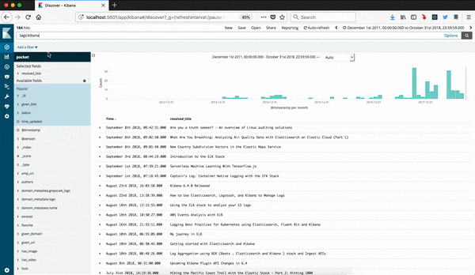

# Pocket Data with Elastic Stack & Docker
This repository will retrieve data from Pocket API, prep data for ingest into the Elastic Stack (Elasticsearch, Logstash, Kibana) using Elastic's official docker images and default ports. 

## Instead of this


## Wouldn't this be better!


**Get the most our your Pocket Data!!**
- Date Added
- Unique URLs
- Unique Given Domain
- Unique Resolved Domain
- Tag Cloud

As you can see, I've been a long time user of Pocket even before it was rebranded from Read It Later.


##### Versions

Example has been tested in following versions:
- Elasticsearch 6.4.2
- Filebeat 6.4.2
- Kibana 6.4.2
- Docker 18.09.0-ce-beta1
- Docker Compose 1.22.0

## Requirements Pocket App
Assumption is that you already have created a Pocket App and have Authenticated. 

If you have an account, but do not have an App, following instructions:

- [Pocket Developer Site](https://getpocket.com/developer/)
- [Create New App](https://getpocket.com/developer/apps/new)
- [Authenticate](https://getpocket.com/developer/docs/authentication)

If you do not have an Pocket Account, jump down to **Launch Containers, Ingest Data**

## Getting Started - Data Prep
1. Retrieving Pocket API Data

    **Best Practice** 

    **Retrieving Full List:** Whenever possible, you should use the since parameter, or count and and offset parameters when retrieving a user's list. After retrieving the list, you should store the current time (which is provided along with the list response) and pass that in the next request for the list. This way the server only needs to return a small set (changes since that time) instead of the user's entire list every time.

    `get-pocket-curl.sh` script performs a "complete" pull data which returns all data about each item, including tags, images, authors, videos, and more. JSON file is saved to `./data/raw` folder

    ``` 
    cd files
    sh ./get-pocket-curl.sh [since]
    ```

2. Prep Pocket Data 
	`prep_pocket.py` script will iterate over the user list: 
	- Removes images and videos
	- Creates list for tags and authors while removing item_id
	- Dumps JSON lines to log file ready for Logstash

    ``` 
    cd files
    python prep_pocket.py
    ```

## Launch Stack to Ingest Data
1. Launch Containers and Test Connections

	Docker Compose Ingest will launch Elasticsearch, Logstash and Kibana office Elastic images.
	`docker-compose -f docker-compose-ingest.yml up`

	- Elasticsearch ([http://localhost:9200](http://localhost:9200))
	- Logstash  ([http://localhost:9600](http://localhost:9600))
	- Kibana ([http://localhost:5601](http://localhost:5601)) 
	

2. Ingest Data with Logstash
	- Logstash will Ingest `*.logs` in `./files/data/prepped` 
	- Creates fields based on uri for given_domain and resolved_domain
	- Transforms UNIX Timestamps to ISO Dates for time_added and time_updated
	- Outputs to Elasticsearch to Pocket Index while setting document_id to item_id 

	Copy logs:
	``` cp ./files/data/raw/*.log ./files/data/prepped/ ```

	Using Sample Data:
	Copy sample-pocket.log `cp ./files/data/sample-pocket.log ./files/data/prepped/`

3. Visualize in Kibana
	- Access Kibana by going to `http://localhost:5601` in a web browser
	- Create Index Pattern:  Click the **Management** tab >> **Index Patterns** tab >> **Create New**. Specify `pocket` as the index pattern name and click **Create** to define the index pattern. (Leave the **Use event times to create index names** box unchecked and the Time Field as @timestamp)
	- Load dashboard into Kibana: Click the **Management** tab >> **Saved Objects** tab >> **Import**, and select `Kibana-Dashboards.json`
	- Open dashboard: Click on **Dashboard** tab and open `Pocket Overview` dashboard

4. Shutdown Stack
You can stop the Stack without loosing data. The ingested data will persist until you remove the volume.

	```docker-compose -f docker-compose-ingest.yml down```

## Launch Stack to Review Data
You can start the Stack with only Elasticsearch and Kibana to view existing data.

	Start: `docker-compose -f docker-compose-minimal.yml up`
	Stop: `docker-compose -f docker-compose-minimal.yml down`

## ToDo
- Cleanup prep_pocket.py 
- Add Section for generating a Pocket API consumer key at https://getpocket.com/developer/apps/new
- Add Filebeat at Ingest Option
- Process to Update Pocket Data