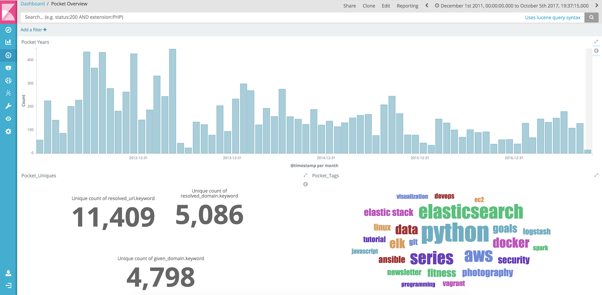

# Pocket Data with Elastic Stack & Docker

## Get the most our your Pocket Data!!
- Date Added
- Unique URLs
- Unique Given Domain
- Unique Resolved Domain
- Tag Cloud



As you can see, I've been a long time user of Pocket even before it was rebranded from Read It Later.

This repository will retrieve data from Pocket API, prep data for ingest into the Elastic Stack (Elasticsearch, Logstash, Kibana) using Elastic's official docker images and default ports. 
Tested with the latest version of the Docker daemon.

## Requirements Pocket App
Assumption is that you already have created a Pocket App and have Authenticated. 

If not, following instructions:

- [Pocket Developer Site](https://getpocket.com/developer/)
- [Create New App](https://getpocket.com/developer/apps/new)
- [Authenticate](https://getpocket.com/developer/docs/authentication)

If you do not have an Pocket Account you can follow the Sample Data Example.

## Getting Started
1. Retrieving Pocket API Data

    **Best Practices** 

    **Retrieving Full List:** Whenever possible, you should use the since parameter, or count and and offset parameters when retrieving a user's list. After retrieving the list, you should store the current time (which is provided along with the list response) and pass that in the next request for the list. This way the server only needs to return a small set (changes since that time) instead of the user's entire list every time.

    `get-pocket-curl.sh` script perform a "complete" pull data which returns all data about each item, including tags, images, authors, videos, and more. JSON file is saved to `./data/raw` folder

    ``` 
    sh ./files/get-pocket-curl.sh [since]
    ```

2. Prep Pocket Data 
	`prep_pocket.py` script will iterate over the user list: 
	- Removes images and videos
	- Removes item_id from tags and authors
	- Create a JSON log file ready for Logstash

    ``` 
    python prep_pocket.py
    ```

3. Launch Containers and Test Connections

	Docker Compose Ingest will launch Elasticsearch, Logstash and Kibana office Elastic images.
	`docker-compose -f docker-compose-ingest.yml up`

	Credentials are always `elastic` and `changeme` 
	- Kibana ([http://localhost:5601](http://localhost:5601)) 
	- Elasticsearch ([http://localhost:9200](http://localhost:9200))