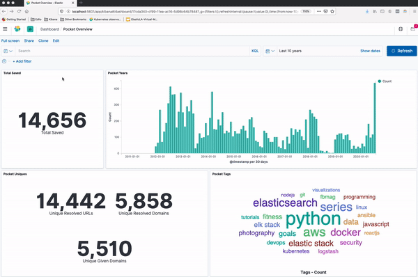

# Pocket Data with Elastic Stack & Docker
This repository will retrieve data from Pocket API, prep data for ingest into the Elastic Stack (Elasticsearch, Logstash, Kibana) using Elastic's official docker images.

## Instead of this


## Wouldn't this be better!


**Get the most our your Pocket Data!!**
- Date Added
- Unique URLs
- Unique Given Domain
- Unique Resolved Domain
- Tag Cloud

As you can see, I've been a long time user of Pocket even before it was rebranded from Read It Later.

##### Tested Versions

Example has been tested in following versions:
- Python 3.8
- Elasticsearch 7.8.0
- Filebeat 7.8.0
- Kibana 7.8.0
- Docker 19.03.8
- Docker Compose 1.25.5

## Requirements Pocket App
Assumption is that you already have created a Pocket App with credentials. 

If you have an account, but do not have an App, following instructions:

- [Pocket Developer Site](https://getpocket.com/developer/)
- [Create New App](https://getpocket.com/developer/apps/new)
- [Authenticate](https://getpocket.com/developer/docs/authentication)

If you do not have an Pocket Account, jump down to **Launch Containers, Ingest Data**

## Getting Started - Data Prep

1. Update Credentials
	Update `config-example.py` with Pocket App credentials then save as `config.py`

2. Retrieve and Prep Pocket Data

	`retrieve-prep-pocket-data.py` will retrieve and prep data from the Pocket API. The default parameter is one day back.
	- Removes images and videos
	- Creates list for tags and authors while removing item_id
	- Dumps JSON lines to log file ready for Logstash

	
	Usage:
	```
	usage: retrieve-prep-pocket-data.py [-h] [-d DAYS_BACK]

	Pass number of days back to start from

	optional arguments:
	-h, --help            show this help message and exit
	-d DAYS_BACK, --days_back DAYS_BACK
							Number of days back
	```

	Example:

		``` 
		cd scripts
		python retrieve-prep-pocket-data.py -d 10
		```


## Launch Stack to Ingest Data
1. Launch Containers and Test Connections

	Docker Compose Ingest will launch Elasticsearch, Logstash and Kibana official Elastic images.

	`docker-compose -f docker-compose-ingest.yml up`

	- Elasticsearch ([http://localhost:9200](http://localhost:9200))
	- Logstash  ([http://localhost:9600](http://localhost:9600))
	- Kibana ([http://localhost:5601](http://localhost:5601)) 
	

2. Ingest Data with Logstash
	- Logstash will Ingest `*.logs` in `./data/logs` 
	- Creates fields based on uri for given_domain and resolved_domain
	- Transforms UNIX Timestamps to ISO Dates for time_added and time_updated
	- Outputs to Elasticsearch to Pocket Index while setting document_id to item_id 

3. Import Visualizations
	- Launch Kibana from browser: `http://localhost:5601`
	- From **Side Navigation Bar**
		- Select **Stack Management**
		- Under Kibana select **Saved Objects**
		- Select **Import**
		- Navigate to local repo then elastic-stack/config/kibana/Kibana780-pocket-dashboards.ndjson
		- Select **Import**
		- Select **Confirm Changes**
		- Select **Done**
	- From **Side Navigation Bar**
		- Select **Dashboard**
		- Select **Pocket Overview**

4. Shutdown Stack
You can stop the Stack without loosing data. The ingested data will persist until you remove the volume.

	```docker-compose -f docker-compose-ingest.yml down```

## Launch Stack to Review Data
You can start the Stack with only Elasticsearch and Kibana to view existing data.

	Start: `docker-compose -f docker-compose.yml up`
	Stop: `docker-compose -f docker-compose.yml down`
